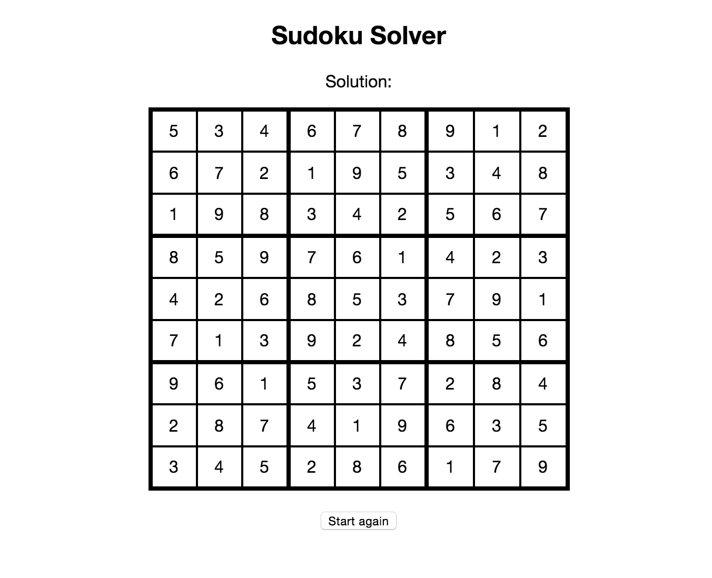

# Sudoku Challenge

## Summary

This was a challenge to build a Sudoku checker using any technology that can automatically generate and solve any 9 x 9 [Sudoku](http://en.wikipedia.org/wiki/Sudoku) grid such as the one below:

## Unsolved

## Solved

> Images courtesy of Wikipedia where you can find more [information](http://en.wikipedia.org/wiki/Sudoku).

I opted to build the app using Node.js and JavaScript. The app currently solves Sudoku puzzles on The Times' website which have a rating of "mild", "easy" or difficult". It does not currently solve puzzles with a rating of "fiendish" and the logic would need to be improved in order achieve this.

## Technologies

- Node.js
- Express.js
- JavaScript
- Jasmine Node
- JSHint
- Mocha
- CasperJS
- Chai
- Grunt
- HTML
- CSS

## Screenshots

### Number entry screen

### Solution screen

## To do list

- Improve logic to solve more fiendish puzzles
- Turn into single page app with Ajax requests
- Improve CSS
